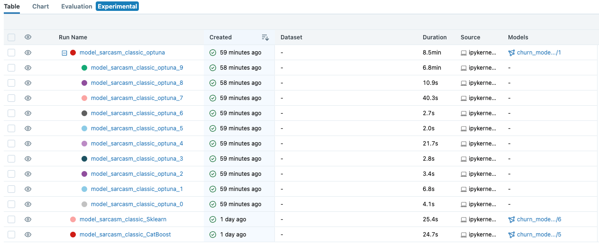
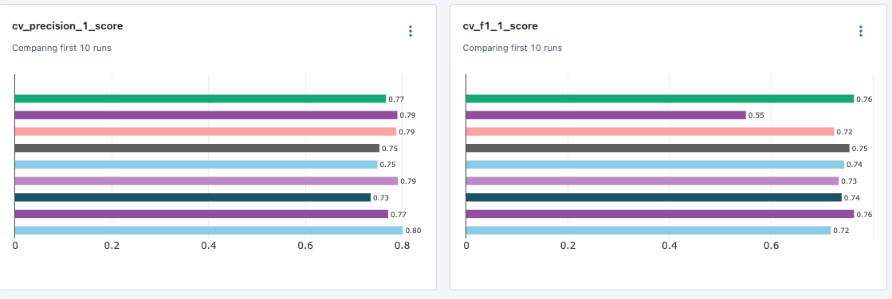

# Вебинар "Интеграция MLflow в процесс разработки моделей машинного обучения"

## Курс "Инженер машинного обучения", Яндекс Практикум

>### Описание кейса

Ваш бывший коллега ушел в отпуск. А заказчик требует результатов уже на этой неделе. Сегодня вам предстоит:

1. Посмотреть на результаты работы коллеги
2. Разобраться в этих материалах
3. Зарегистрировать модель на удаленном сервере MLFlow
4. Подготовить инференс-выгрузку для заказчика

> Напоминаю: Дедлайн был вчера, поэтому быстрее за работу)

>### Немного о данных

1. Данные лежат в папке `data`
2. Данные представляют собой выгрузки для классификации на поиск сарказма
3. Файл `Sarcasm_Headlines_Dataset_v2.json` -- предназначен для обучения модели
4. Файл `Sarcasm_Headlines_Dataset.json` -- предназначен для инференса модели

>### Как работать с проектом?

>#### 1. Скачивание и установка зависимостей

1. Чтобы редактировать репозиторий, необходимо сделать его копию. Это делается по кнопке `fork`.

2. Клонируем репозиторий на своё локальное устройство (но лучше все-таки на виртуальное устройство):

~~~
git clone <адрес вашей копии репозитория>
~~~

3. Создаём новую ветку:

~~~
git checkout -b <имя новой ветки>
~~~

4. Установка нужных библиотек и окружения:

~~~
python -m venv <имя папки для хранения окружения>
source <имя папки для хранения окружения>/bin/activate
python -m pip install --upgrade pip
pip install -r requirements.txt
~~~

P.S. Некоторые зависимости могут мешать установить ту или иную библиотеку. Для избежания этого можно удалить библиотеки, которые вылетают с ошибкой, в отдельный файл, после чего с помощью флага `--no-deps` установить эти библиотеки. Тогда команда примет вид:

~~~
pip install -r requirements_2.txt --no-deps
~~~

5. (**Для воркшрпа**) Переименуйте `.env_template_for_workshop` файл в `.env`. Так как вы будете запускать и хранить все артефакты на удаленном устройстве, вам нужно сохранить те параметры, которые указаны в этом файле.

5. (**Для домашней работы**) Переименуйте `.env_templatefor_homework` файл в `.env`. Так вы сможете сделать запуск на персональном устройстве или ВМ. Артефакты и данные будут храниться в вашем хранилище S3 и PostgreSQL соответственно.

6. Для запуска Tracking Server выполните команду `sh run_public.sh`.

7. Готово! Можно проверить работоспособность окружения и Tracking Server.

>#### 2. Что же на данный момент готово? (**Только на вебинаре**)

Ваш коллега успел обучить несколько простых пайпланов, а также провел подбор гиперпараметров.

В ходе экспериментов коллега максимизировал определенную метрику качества. Но не совсем понятно что именно это за метрика и почему он выбрал именно ее.

Радует тот факт, что он оставил хотя бы какую-то информацию, и нам не придется начинать сначала.

**P.S.** Если вы хотите, чтобы у вас появились те же артефакты, что и в ходе практического занятия, запустите последовательно ячейки ноутбука `sarcasm.ipynb`

>#### 3.1. Практическое задание (**На вебинаре**)

1. Зайдите на сервер MLflow (нужно постучаться по этому адресу <http://84.201.139.14:5000>)
2. Выберите эксперимент, получите информацию о моделях, которые в нём содержатся.
    - Создайте ноутбук с любым названием для работы.
    - Импортируйте модель
    - Попробуйте выполнить инференс модели на любом кусочке данных
3. Создайте файл MLproject. Сделайте эксперимент воспроизводимым, добавив несколько entry_points (примеры entry_points представлены в файле)
    - Для реализации отправки параметров через терминал можете использовать модуль `click` и декораторы `@click.option()` & `@click.command()`
4. Выполните запуск эксперимента через MLproject, измените статус полученной модели на «production»
    - Измените название запуска (в качестве имени предлагаю использовать <'sarcasm_' + иницалы>)
    - В качестве команды запуска используйте `mlflow run . --entry-point <entry-point name>`
    - Попробуйте запустить только 2 основных этапа `prepare_data` & `baseline_model`
    - Если будете запускать этап optuna помните, что 10 итераций выполняется от 2 до 12 минут
    - В качестве файла с данными используйте `Sarcasm_Headlines_Dataset.json`
5. Измените `staging` моделей (примеры можно найти в файле `test.ipynb`)

>#### 3.2. Практическое задание (**На вебинаре**)

1. Зайдите на сервер MLflow (Если запускали по инструкции, то <127.0.0.1:5000>)
2. Ознакомьтесь с информацией в ноутбуке `test.ipynb`
3. Попробуйте переименовать название эксперимента
4. Выполните запуск эксперимента через MLproject, измените статус полученной модели на «production»
    - Измените название запуска (в качестве имени предлагаю использовать иницалы)
    - В качестве команды запуска используйте `mlflow run . --entry-point <entry-point name>`
    - Попробуйте запустить только 2 основных этапа `prepare_data` & `baseline_model`
    - Если будете запускать этап optuna помните, что 10 итераций выполняется от 2 до 12 минут
    - В качестве файла с данными используйте можете использовать `Sarcasm_Headlines_Dataset.json`, чтобы задание не повторялось с вокршопом
    **P.S.** В качестве флага окружения рекомендую использовать `mlflow run . --entry-point baseline --env-manager local`, так как в `mlflow run` могут быть проблемы с зависимостями, которые может решить только докер
5. Измените `staging` моделей (примеры можно найти в файле `test.ipynb`)
6. В качестве результатов выполнения можете прикрепить в репозиторий скриншоты, или скинуть свою версию файла `test.ipynb`.

**Дополнительно**

1. В качестве дополнительного задания реализуйте полноценный запуск всего пайплайна (воспользуйтесь рекомендациями в конце описания):
    - Для этого добавьте `entry_point "main"`
    - Пайплайн должен содержать: подготовку данных, обучение базовой модели, подбор гиперпараметров. Соответственно нужен вызов всех трех `entry_points`

>#### 3.3. Реализация предиктов обученной моделью

**Предикт модели на Spark датафремах**

~~~
import mlflow
from pyspark.sql.functions import struct, col
logged_model = 'runs:/e1785754ad8b46f7ba7cb722d1add4d1/via_models'

# Load model as a Spark UDF. Override result_type if the model does not return double values.
loaded_model = mlflow.pyfunc.spark_udf(spark, model_uri=logged_model, result_type='double')

# Predict on a Spark DataFrame.
df.withColumn('predictions', loaded_model(struct(*map(col, df.columns))))
~~~

**Предикт модели на Pandas датафремах**

~~~
import mlflow
logged_model = 'runs:/e1785754ad8b46f7ba7cb722d1add4d1/via_models'

# Load model as a PyFuncModel.
loaded_model = mlflow.pyfunc.load_model(logged_model)

# Predict on a Pandas DataFrame.
import pandas as pd
loaded_model.predict(pd.DataFrame(data))
~~~

>#### 4. Шпаргалка для работы с гитом

1. Добавляем изменения в индекс:

~~~
git add .
~~~

2. Создаём коммит:

~~~
git commit -m "Описание того, что было изменено"
~~~

3. Отправляем изменения в удалённый репозиторий:

~~~
git push
~~~

Если вы локально создали новую ветку, эта команда не сработает, но git сам подскажет, как её модернизировать, чтобы добавить ветку. Можно просто скопировать :)

>#### 5. Архитектура проекта

==============================

    ├── README.md 
    │         
    ├── data               <- Папка c локальными данными
    │
    ├── notebooks          <- Ноутбук с разведочным анализом данных
    │
    ├── src                <- Здесь хранятся заготовки под скрипты
    │
    ├── requirements.txt   <- Файл с зависимостями
    │
    ├── python_venv.yaml   <- Окружение проекта для MLflow
    │
    ├── .env_template      <- Файл с параметрами вашего окружения. Необходимо создать файл `.env` или переименовать этот файл и добавить в него свои параметры.
    │
    └── MLProject          <- Сущность для бесперебойной работы моделей            

-----------------

>#### 6. В случае ошибок

Так как ошибки неизбежны, предлагаю выполнять следующие действия:

Если действие происходит на вебинаре:

1. Не стесняйтесь задать вопрос. Вероятно кто-то столкнулся с такой же проблемой, вместе мы сможем решить проблему быстрее.
2. Желательно скинуть скрины кода, который вы написали и место с ошибкой, если такое имеется.

Если вы попрактиковаться за пределами вебинара:

1. Погуглите, скорее всего кто-то уже пытался это решить.

2. Если не понимаете, что нагуглили, или не нагуглили вовсе, предлагаю 2 доступных варианта:

    - создать тему с обсуждением на GitHub и приложить свою ошибку, мы постараемся вам помочь.
    - Создайте PullRequest в `main` и внутри описания изменений напишите свою ошибку, тогда мы сможем помочь оперативнее. Мы смотрим ваши пулреквесты.

>#### 7. Рекомендации

У MLflow наверное самая понятная и адекватная документация в мире, так что смело можете обращаться к ней.

Так же в репозитории есть хорошие примеры, вот один из них <https://github.com/mlflow/mlflow/blob/master/examples/multistep_workflow/MLproject>

> ## Мы будем рады, если данный код поможет вам попрактиковать свои навыки в работе с MLflow и запуском сторонних репозиториев 🥸
